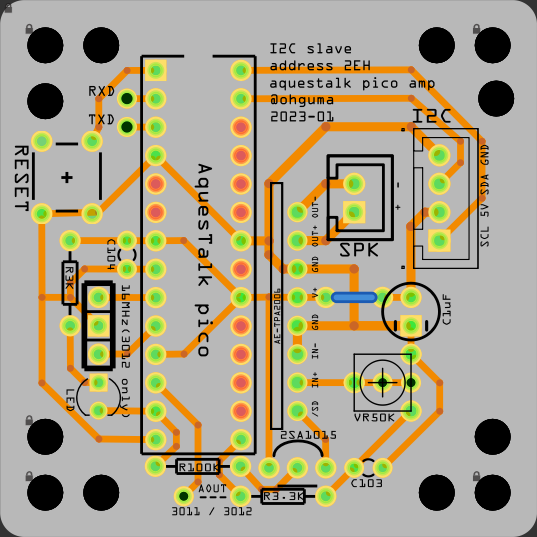
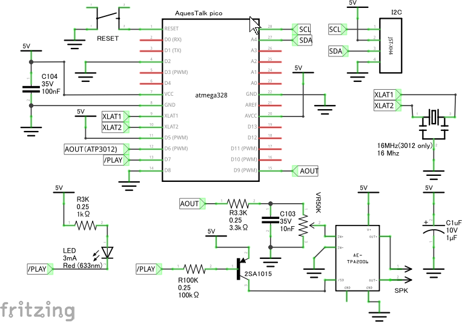

# AquesTalk Pico アンプ基板

+ [音声合成LSI 「AquesTalk pico LSI」](hhttps://www.a-quest.com/products/aquestalkpicolsi.html)をアンプ回路と共に別マイコンとI2C接続で使うための基板。
+ アンプ回路はATP3012のデータシートにある[ＴＰＡ２００６使用　超小型Ｄ級アンプキット](https://akizukidenshi.com/catalog/g/gK-08161/)を使う。
+ ATP3012とATP3011のどちらでも利用できる。詳細はデータシート参照。
  - ATP3012 要XTAL。16MHzの場合、電源3VはNG。3V時は10MHzにする。
  - ATP3011 内蔵RC発信のため、XTAL不要。2.5V ～ 5.5Vで動作する。

## スケッチについて

+ [[Arduino] AquesTalk ライブラリ](http://blog-yama.a-quest.com/?eid=970151)のサンプルスケッチに利用方法が網羅されている。

## 基板・回路図

- 
- 

----
2023-01-27 ohguma